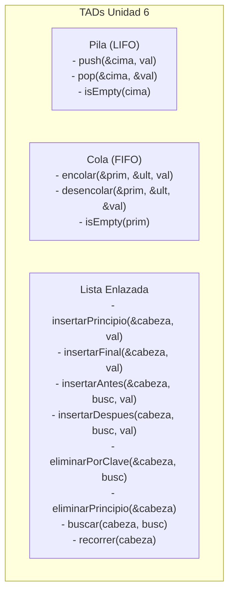

# Informe de Modificaciones y Justificación Teórica

**Cátedra:** Programación I — Ingeniería en Informática (UNCa)  
**Unidad Temática:** Unidad 6 - Asignación Dinámica de Memoria y Tipos Abstractos de Datos (TADs)  
**Archivos Analizados:** [`pila.c`](file:///C:/Users/Mariano_caniza/Desktop/trabajo%20practico/C/practicando/examen%20final/pila.c), [`cola.c`](file:///C:/Users/Mariano_caniza/Desktop/trabajo%20practico/C/practicando/examen%20final/cola.c), [`lista.c`](file:///C:/Users/Mariano_caniza/Desktop/trabajo%20practico/C/practicando/examen%20final/lista.c)

---

## 1. Resumen General del Estado Inicial

Los tres programas contaban con una base sólida de implementación dinámica (asignación en *Heap*, uso de punteros dobles para modificar la cabeza/cima/extremos por referencia, y funciones de verificación de estado).

Se realizaron ajustes específicos para:
1. **Alinear la terminología y algoritmos** con el apunte oficial y las diapositivas de la cátedra del Lic. Daniel A. Rivas.
2. **Cubrir operaciones esenciales de examen final** que faltaban (como la eliminación por clave en cualquier posición de una lista).
3. **Garantizar buenas prácticas de gestión de memoria** (*casting* explícito según la bibliografía y liberación total de nodos al finalizar el programa).

---

## 2. Detalle de Modificaciones por Archivo

### A. TAD Pila ([`pila.c`](file:///C:/Users/Mariano_caniza/Desktop/trabajo%20practico/C/practicando/examen%20final/pila.c))

#### Modificaciones Realizadas:
1. **Comentarios de encabezado y operaciones:**
   - Se añadió la definición formal del TAD Pila bajo el modelo **LIFO** (*Last-In, First-Out*).
   - Se documentó el rol del puntero doble `nodo **cima` (paso por referencia para que la función modifique la cima real del `main`).
2. **Conceptos de Error de la Cátedra:**
   - En `push`: Se vinculó el fallo de `malloc` con la condición de **Overflow** (desbordamiento / agotamiento de memoria dinámica).
   - En `pop`: Se vinculó el intento de extraer de una pila vacía con la condición de **Underflow** (desbordamiento negativo).

#### ¿Por qué?
> [!NOTE]
> En los exámenes teóricos y prácticos de Programación I, los docentes evalúan explícitamente el entendimiento de los términos **LIFO**, **Underflow** y **Overflow**, así como el motivo por el cual se pasa `&cima` (puntero a puntero).

---

### B. TAD Cola ([`cola.c`](file:///C:/Users/Mariano_caniza/Desktop/trabajo%20practico/C/practicando/examen%20final/cola.c))

#### Modificaciones Realizadas:
1. **Documentación del modelo FIFO:**
   - Se aclaró la semántica de los dos extremos: **Frente / Primero** (para extracción/lectura) y **Final / Último** (para inserción).
2. **Énfasis en el caso de 1 solo elemento en `desencolar`:**
   - Se destacó con comentarios la línea crítica:
     ```c
     if (*pp_primero == NULL) {
         *pp_ultimo = NULL;
     }
     ```
3. **Aclaraciones en el menú:**
   - Se explicitó la relación entre las opciones del menú y los términos formales (*Encolar = Insertar al final*, *Desencolar = Eliminar del frente*).

#### ¿Por qué?
> [!IMPORTANT]
> Si al desencolar el último elemento no se actualiza `ultimo = NULL`, el puntero `ultimo` queda apuntando a memoria ya liberada (*dangling pointer* / puntero colgante), lo que causa fallos al intentar volver a encolar. Este caso particular está resaltado en la diapositiva de la cátedra *"Eliminar un elemento de una cola con un solo elemento"*.

---

### C. TAD Lista Simplemente Enlazada ([`lista.c`](file:///C:/Users/Mariano_caniza/Desktop/trabajo%20practico/C/practicando/examen%20final/lista.c))

Este archivo fue el que recibió la mayor cantidad de mejoras funcionales y estructurales:

#### Modificaciones Realizadas:

1. **Incorporación de la función `eliminarPorClave` (Diapositiva 66 de la Cátedra):**
   - *Antes:* Solo existía `eliminarPrincipio`, imposibilitando borrar nodos intermedios o finales por valor.
   - *Ahora:* Se añadió la función que implementa la búsqueda con dos punteros (`actual` y `anterior`) y contempla los dos casos:
     - **Caso 1 (Cabeza):** Si el dato está en el primer nodo, `*cabeza = actual->sig`.
     - **Caso 2 (Intermedio/Final):** Si está en otra posición, `anterior->sig = actual->sig`.
     - Liberación de memoria con `free(actual)`.

2. **Incorporación de `vaciarLista`:**
   - *Antes:* Al salir del menú (`opcion == 0`), los nodos quedaban en memoria (*memory leak*).
   - *Ahora:* Se recorre y libera cada nodo con `free()` antes de terminar el `main()`.

3. **Moldeado explícito (*Casting*) en llamadas a `malloc`:**
   - *Antes:* `nuevo = malloc(sizeof(Nodo));`
   - *Ahora:* `nuevo = (Nodo*) malloc(sizeof(Nodo));`

4. **Validación de memoria disponible:**
   - Se agregaron mensajes de error (`"Error: Insuficiente espacio de memoria."`) cuando `malloc` retorna `NULL`, tal como se indica en el apunte.

5. **Actualización del Menú Interactivo:**
   - Se integró la nueva opción `7. Eliminar nodo por clave` y se reorganizó el orden de opciones.

#### ¿Por qué?
> [!TIP]
> - La eliminación de un nodo arbitrario por clave es una de las preguntas de código más frecuentes en exámenes finales de la UNCa.
> - El apunte de la cátedra indica explícitamente: *"Estas funciones requieren, generalmente, moldeado (conversión de tipos)"*.
> - Liberar la memoria dinámica reservada en el *Heap* demuestra dominio completo del ciclo de vida de la memoria.

---

## 3. Cuadro Comparativo de Correspondencia con la Cátedra



---

## 4. Estado de Compilación

Todos los archivos han sido verificados y compilados exitosamente bajo el compilador GCC con advertencias estrictas activadas:

```powershell
gcc -Wall -Wextra .\pila.c -o .\pila.exe
gcc -Wall -Wextra .\cola.c -o .\cola.exe
gcc -Wall -Wextra .\lista.c -o .\lista.exe
```
**Resultado:** 0 errores, 0 advertencias (*warnings*).
